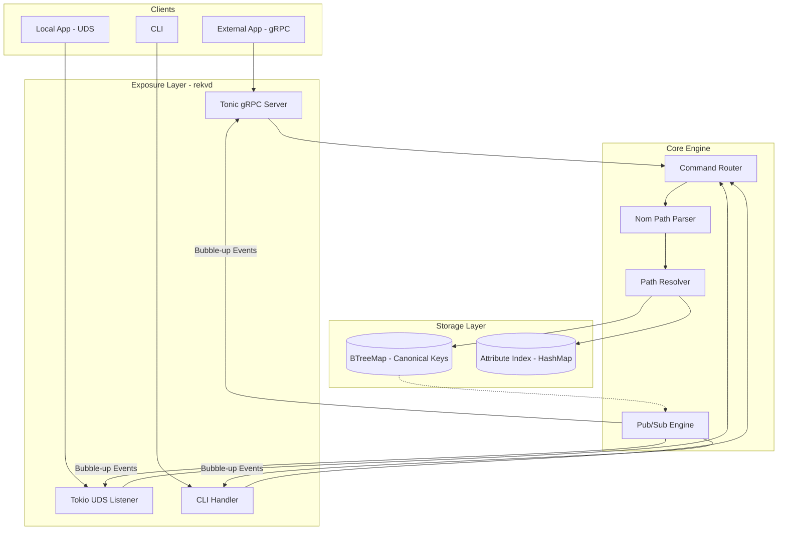
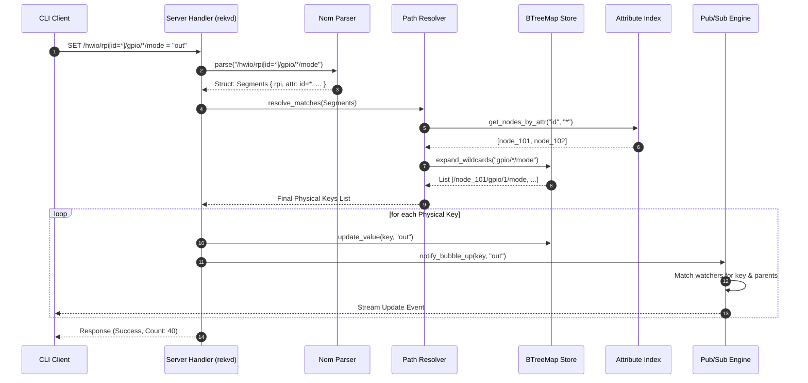

# Rust Embedded Key Value store

This project aims to create a lightweight, embedded key-value store for embedded projects, focusing on ease of deployment and usage. The previous Redis dependency has been removed to simplify the architecture and reduce external dependencies.

## 1. Data Model & Addressing

*   **Hierarchical Paths**: Nodes are organized in a tree using XPath-like addressing (e.g., `/net/eth0/config`).
*   **Predicates (Attributes)**: Nodes can have multiple key-value metadata attributes. Addressing supports filtering: `/device[type="sensor"][vendor="bosch"].`
*   **Value Types**: Support for JSON-like values (String, Number, Boolean, Null) and Binary blobs.
*   **Canonical Mapping**: Every unique entity has a hidden UUID or a "Physical Path" that the Virtual XPath resolves to. This canonical mapping is stored efficiently using a `BTreeMap` for ordered and fast lookups.

## 2. Functional Features

*   **Atomic Write**: Standard SET for a specific XPath-addressable path.
*   **Broadcast Write**: Wildcard `*` or `**` (recursive) to update multiple nodes in one transaction.
    Example:
    ```
    SET /hwio/gpio[mode=*] value="output"
    ```
*   **Bubble-Up Watch**: Subscribing to an XPath-addressable path `/a/b` notifies the client of changes to `/a/b/c/d`.
*   **Attribute Queries**: GET requests that return a collection of nodes matching a predicate, sorted lexicographically by path.

## 3. Interface & Access (The "Exposure" Layer)

This layer will be implemented using `tokio` to handle multiple protocols for client interaction.

*   **gRPC (via tonic)**: Use for cross-language support and streaming.
    *   `rpc Watch(PathRequest) returns (stream Event)` (Perfect for the bubble-up feature).
    *   `rpc Set(SetRequest) returns (SetResponse)`
    *   `rpc Get(GetRequest) returns (GetResponse)`
*   **UDS (Unix Domain Sockets)**: For local Rust/C apps requiring ultra-low latency. This will use a simple length-prefixed Protobuf over UDS or a JSON-RPC style.
*   **Internal Command Bus**: Both gRPC and UDS handlers convert requests into a `Command` enum and send them to the Store actor.

### High level architecture:


## 4. Critical Modules/Components

*   **`rekvd` Service**: The main daemon application responsible for running the Exposure Layer, Core Engine, and Storage Layer.
*   **`rekv` CLI**: A separate binary that acts as a client to `rekvd`, primarily interacting via UDS for local operations and potentially gRPC for remote.
*   **`config.rs`**: Handles the in-memory storage, file persistence, and atomic updates of the configuration.
*   **`api/grpc.rs`**: Defines the gRPC service using `tonic` and implements the `Watch`, `Set`, and `Get` RPCs.
*   **`api/uds.rs`**: Implements the Unix Domain Socket server for local, low-latency communication.
*   **`cli/mod.rs`**: Contains the logic for parsing command-line arguments and dispatching requests to the `rekvd` service.
*   **`path_parser.rs`**: Implements the `Nom` based parser for hierarchical XPath-like paths and predicates.
*   **`path_resolver.rs`**: Resolves virtual XPath-like paths to physical keys within the storage layer, leveraging the `BTreeMap` for efficient lookups.
*   **`pubsub_engine.rs`**: Manages subscriptions and broadcasts "bubble-up" events to interested clients.
*   **`storage.rs`**: Encapsulates the `BTreeMap` for canonical keys and `HashMap` for attribute indexing, providing the core storage mechanisms.

### Broadcast Set and Bubble up
